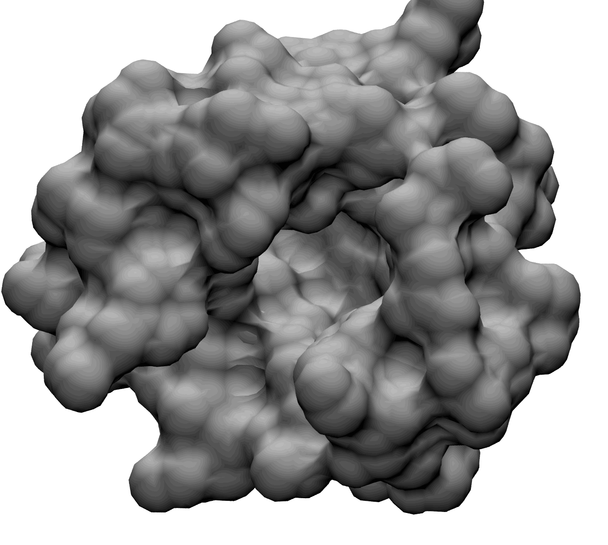
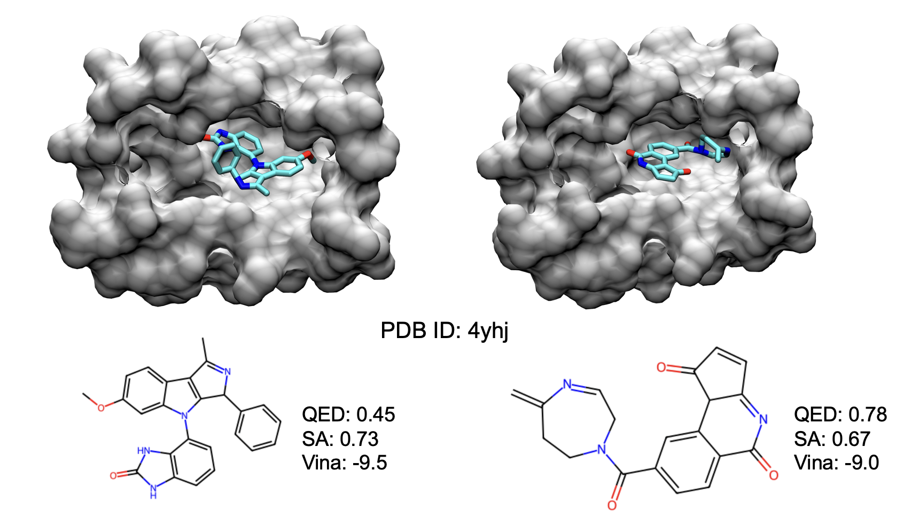

# autofragdiff
=======




# Dependencies
- RDKit
- openbabel
- PyTorch
- biopython
- biopandas
- networkx
- py3dmol
- scikit-learn
- tensorboard
- wandb
- pytorch-lightning

## Create conda environment
```
conda create -n gfragdiff
pip install rdkit
conda install -c conda-forge openbabel
pip3 install torch torchvision torchaudio 
pip install biopython
pip install biopandas
pip install networkx
pip install py3dmol
pip install scikit-learn
pip install tensorboard
pip install wandb
pip install tqdm
pip install pytorch-lightning==1.6.0
```

The model has been tested with the following software versions:

| Software        | Version     |
| --------------- | ----------- |
| rdkit           | 2023.3.1    |
| openbabel       | 3.1.1       |
| pytorch         | 2.0.1       |
| biopython       | 1.81        |
| biopandas       | 0.4.1       |
| networkx        | 3.1         |
| py3dmol         | 2.0.1.      |
| scikit-learn    | 1.2.2       |
| tensorboard     | 2.13.0      |
| wandb           | 0.15.2      |
| pytorch-lightning | 1.6.0     |


## QucikVina2
For Docking with qvina install QuickVina2:
```
wget https://github.com/QVina/qvina/raw/master/bin/qvina2.1
chmod +x qvina2.1 
```
We also need MGLTools for preparing the receptor for docking (pdb->pdbqt) but it can mess up the conda environment, so make a new one.
```
conda create -n mgltools -c bioconda mgltools
```

# Data Preparation

## CrossDock
Download and extract the dataset as described by the authors of Pocket2Mol: https://github.com/pengxingang/Pocket2Mol/tree/main/data

process the molecule fragments using a custom fragmentation. 
```
python process_crossdock.py --rootdir $CROSSDOCK_PATH --outdir $OUT_DIR \
      --dist_cutoff 7. --max-num-frags 8 --split test --max-atoms-single-fragment 22 \
      --add-Vina-score --add-QED-score --add-SA-score --n-cores 16
```
- For adding Vina you also need to generate pdbqt files for each receptor and crystallographic ligand.

# Training

## Training AutoFragdiff. 
```
python train_frag_diffuser.py --data $CROSSDOCK_DIR  --exp_name CROSSDOCK_model_1 \
        --lr 0.0001 --n_layers 6  --nf 128  --diffusoin_steps 500 \
       --diffusion_loss_type l2 --n_epochs 1000 --batch_size 4
```

## Training anchor predictor
```
python train_anchor_predictor --data $CROSSDOCK_DIR --exp_name CROSDOCK_anchor_model_1 \
        --n_layers 4 --inv_sublayers 2 --nf 128 --dataset-type CrossDock
```


# Sampling:

Firt download the trained models from the google drive in the following link

https://drive.google.com/drive/folders/1DQwIfibHIoFPGJP6aHBGiYRp87bCZFA0?usp=share_link

## CrossDock pocket-based molecule generation:

To generate molecules from trained pocket-based model, also use anchor-predictor and fragment size predictor models

## CrossDock pocket-based molecule generation (with guidance):

To generate molecules for crossdock test set:
```
python sample_crossdock_mols.py --results-path results/ --data-path $(path-to-crossdock-dataset) --use-anchor-model --anchor-model anchor-model.ckpt --n-samples 20 --exp-name test-crossdock --diff-model pocket-gvp.ckpt --device cuda:0 
```



To sample molecules from a pdb file:
first run fpocket and identify the correct pocket using:
```
fpocket -f $pdb.pdb
```
fpocket gives multiple pockets, you can visualize the identify the right pocket and run sampling

```
python sample_from_pocket.py --result-path results --pdb $pdbname --use-anchor-model --anchor-model anchor-model.ckpt --n-samples 10 --device cuda:0 --pocket-number 1 
```

## Scaffold-based molecule property optimization

For scaffold-based optimization you need the pdb file of the pocket and the sdf file of the scaffold molecule (and the original molecule). 

Scaffold-extension for crossdock test set
```
python scaffold_based_mol_generation.py --data-path $(path-to-crossdock) --results-path scaffold-gen --use-anchor-model --anchor-model anchor-model.ckpt --n-samples 20 --exp-name scaffold-gen --diff-model pocket-gvp.ckpt --device cuda:0 
```

- In order to select the anchor you can add the `--custom-anchors` argument and provide the ids of custom anchors (starts from 0 and based on atomic ids in the scaffold molecule).


