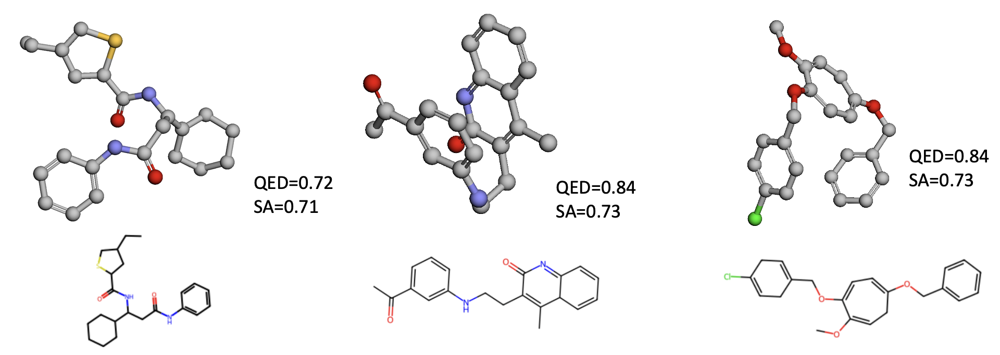

<<<<<<< HEAD
# autofragdiff
=======
# keiserlab-genentech
Genentech-KeiserLab collaborative repo and project tracker

This is the first version of GuidedFragDiff model.


# Dependencies
- RDKit
- openbabel
- PyTorch
- biopython
- biopandas
- networkx
- py3dmol
- scikit-learn
- tensorboard
- wandb
- pytorch-lightning

## Create conda environment
```
conda create -n gfragdiff
pip install rdkit
conda install -c conda-forge openbabel
pip3 install torch torchvision torchaudio 
pip install biopython
pip install biopandas
pip install networkx
pip install py3dmol
pip install scikit-learn
pip install tensorboard
pip install wandb
pip install tqdm
pip install pytorch-lightning==1.6.0
```

The model has been tested with the following software versions:

| Software        | Version     |
| --------------- | ----------- |
| rdkit           | 2023.3.1    |
| openbabel       | 3.1.1       |
| pytorch         | 2.0.1       |
| biopython       | 1.81        |
| biopandas       | 0.4.1       |
| networkx        | 3.1         |
| py3dmol         | 2.0.1.      |
| scikit-learn    | 1.2.2       |
| tensorboard     | 2.13.0      |
| wandb           | 0.15.2      |
| pytorch-lightning | 1.6.0     |


## QucikVina2
For Docking with qvina install QuickVina2:
```
wget https://github.com/QVina/qvina/raw/master/bin/qvina2.1
chmod +x qvina2.1 
```
We also need MGLTools for preparing the receptor for docking (pdb->pdbqt) but it can mess up the conda environment, so make a new one.
```
conda create -n mgltools -c bioconda mgltools
```

# Data Preparation

## GEOM-drugs
first download GEOM-DRUGS dataset:
```
mkdir $GEOMDRUGS
wget https://dataverse.harvard.edu/api/access/datafile/4327252 -O $GEOMDRUGS/rdkit_folder.tar
tar -xvf $GEOMDRUGS/rdkit_folder.tar
```
Genearte the molecule conformers in a SDF file:
```
python generate_geom_conformers.py --geom-json $GEOMDRUGS/summary_drugs.json \
       --geom-root $GEOMDRUGS \
       --generated-splits $GEOMDRUGS/generated_splits.csv \
       --output $OUTPUT/geom_conformers.sdf 
```
Prepare the molecule fragments using a custom fragmentation. For guidance include `add-QED` and `add-SA`.
```
python process_GEOM.py --sdf-path $GEOMDRUGS/geom_conformers.sdf --split val \
       --max-num-frags 8 --save-path $SAVE_PATH --max-atoms-single-fragment 22 \
       --add-QED --add-SA 
```

## CrossDock
Download and extract the dataset as described by the authors of Pocket2Mol: https://github.com/pengxingang/Pocket2Mol/tree/main/data

process the molecule fragments using a custom fragmentation. 
```
python process_crossdock.py --rootdir $CROSSDOCK_PATH --outdir $OUT_DIR \
      --dist_cutoff 7. --max-num-frags 8 --split test --max-atoms-single-fragment 22 \
      --add-Vina-score --add-QED-score --add-SA-score --n-cores 16
```
- For adding Vina you also need to generate pdbqt files for each receptor and crystallographic ligand.

# Training

## Training GEOM-drugs
```
python train_frag_diffuser.py --data $GEOMDRUGS_DIR  --exp_name GEOM_model_1 \
        --lr 0.0002 --n_layers 6 --inv_sublayers 2 --nf 128 --dataset-type GEOM --diffusoin_steps 500 \
        --diffusion_noise_schedule polynomial_2 --diffusion_loss_type l2 --n_epochs 1000 --batch_size 16
```
In order to train the GEOM-drugs with guidance add `--use-guidance` and `guidance-feature QED/SA`.


## Training CrossDock. 
```
python train_frag_diffuser.py --data $CROSSDOCK_DIR  --exp_name CROSSDOCK_model_1 \
        --lr 0.0001 --n_layers 6 --inv_sublayers 2 --nf 128 --dataset-type CrossDock --diffusoin_steps 500 \
        --diffusion_noise_schedule polynomial_2 --diffusion_loss_type l2 --n_epochs 1000 --batch_size 16
```

In order to train CrossDock with guidance add `--use-guidance` and `guidance-feature Vina/QED/SA`. 

## Training anchor predictor (w/wo guidance)
```
python train_anchor_predictor --data $CROSSDOCK_DIR --exp_name CROSDOCK_anchor_model_1 \
        --n_layers 4 --inv_sublayers 2 --nf 128 --dataset-type CrossDock/GEOM --use-guidance \
        --guidance-feature 
```

## Training fragment size predictor (w/wo guidance)(classification)
```
python train_fragsize_predictor --data $CROSSDOCK_DIR --exp_name CROSDOCK_fragsize_model_1 \
        --n_layers 4 --inv_sublayers 2 --nf 128 --dataset-type CrossDock/GEOM --use-guidance \
        --guidance-feature --task classification --loss_weights 
```

# Sampling:

Firt download the trained models from the google drive in the following link

https://drive.google.com/drive/folders/1DQwIfibHIoFPGJP6aHBGiYRp87bCZFA0?usp=share_link

##  GEOM-drugs molecule generation

In order to generate molecules from the trained GEOM-drugs model, I also trained an anchor predictor model that can be used during inference.

```
python generate_mols.py --result-path $RESULT_PATH --diff-model GEOM-QED-diff.ckpt --exp-name GEOM-generated-1 \
       --use-anchor-model --anchor-model GEOM-anchor-model.ckpt --n-ligands 1000 --device cuda:0
```


To sample molecules from trained GEOM-drugs with SA/QED guidance:
```
python generate_mols.py --result-path $RESULT_PATH --diff-model GEOM-QED-diff.ckpt --exp-name GEOM-QED-class-6 \
       --use-guidance --guidance-feature QED --use-anchor-model --use-fragsize-model \
       --anchor-model GEOM-QED-anchor-model.ckpt --fragsize-model GEOM-QED-fragsize-model.ckpt  \ 
       --guidance-scale 2. --guidance-class 6 --device cuda:0
```

A few sampled molecules from highest class:



## CrossDock pocket-based molecule generation:

To generate molecules from trained pocket-based model, also use anchor-predictor and fragment size predictor models
```
python generate_pocket_molecules.py --result-path $RESULT_PATH --diff-model diff-model.ckpt --exp-name Crossdock-generated-1 \
        --use-anchor-model --use-fragsize-model --anchor-model anchor_model.ckpt --fragsize-model fragsize_model.ckpt  \ 
        --fragsize-model-type Classification --data-path $CROSSDOCK_DATA_DIR --device cuda:0
```

## CrossDock pocket-based molecule generation (with guidance):

To generate molecules based on pocket with vina guidance:
```
python generate_pocket_molecules.py --result-path $RESULT_PATH --diff-model diff-model-vina.ckpt --exp-name Crossdock-vina-class-6 \
        --use-anchor-model --use-fragsize-model --anchor-model anchor_model-vina.ckpt \
        --fragsize-model fragsize_model-vina.ckpt  --use-guidance --guidance-class 6 --guidance-scale 2. \ 
        --fragsize-model-type Classification --data-path $CROSSDOCK_DATA_DIR --device cuda:0
```


- To add rejection-sampling during inference (for CrossDock) add `--rejection-sampling`. With rejection-sampling, at each step after a fragment is generated, we compute the vina score of the molecule with the added fragment. If the fragment improves the vina score of the fragment, the fragment is accepted. If the fragment does not improve the vina score but the different between vina scores is less than 1kcal/mol we accept the fragment with 50% probability.


## Scaffold-based molecule property optimization

For scaffold-based optimization you need the pdbqt file of the pocket and the sdf file of the scaffold molecule (and the original molecule). 

```
python scaffold_based_mol_generation.py --scaffold-path scaffolds/1a2g_scaff.sdf --use-guidance --guidance-feature Vina \
              --guidance-class 6 --use-fragsize-model --use-anchor-model --anchor-model anchor_model-vina.ckpt \
              --fragsize-model fragsize_model-vina.ckpt --guidance-scale 2. --n-ligands 200 --exp-name scaffold_1a2g \
              --diff-model diff-model-vina.ckpt --rejection-sampling --device cuda:0
```

- In order to select the anchor you can add the `--custom-anchors` argument and provide the ids of custom anchors (starts from 0 and based on atomic ids in the scaffold molecule).
>>>>>>> 8512036 (Initial commit)
